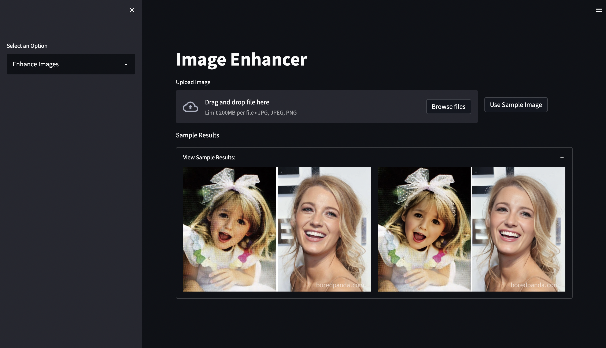
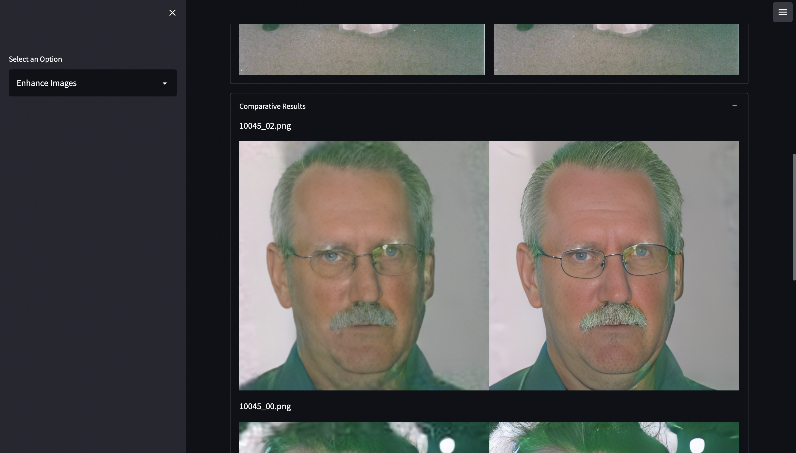

            


# GFPGAN Image Restoration - Streamlit Application
This Streamlit application demonstrates how GFPGAN works in realtime.
## What is GFPGAN Image Restoration?
GFP-GAN is a generative adversarial network for blind face restoration that leverages a generative facial prior (GFP). This Generative Facial Prior (GFP) is incorporated into the face restoration process via channel-split spatial feature transform layers, which allow for a good balance between realness and fidelity. As a whole, the GFP-GAN consists of a degradation removal module (U-Net) and a pretrained face StyleGAN as a facial prior. They are bridged by a latent code mapping and several Channel-Split Spatial Feature Transform (CS-SFT) layers. During training, 1) intermediate restoration losses are employed to remove complex degradation, 2) Facial component loss with discriminators is used to enhance facial details, and 3) identity preserving loss is used to retain face identity.
<div><b><a href="README_official.md">Read Official Readme Document</a></div>





---
## Usage
- ```bash
    pip install -r requirements.txt
    ```
- ```bash
    streamlit run app.py
    ```
